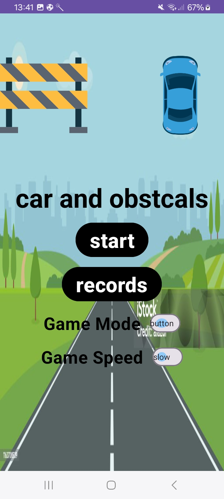
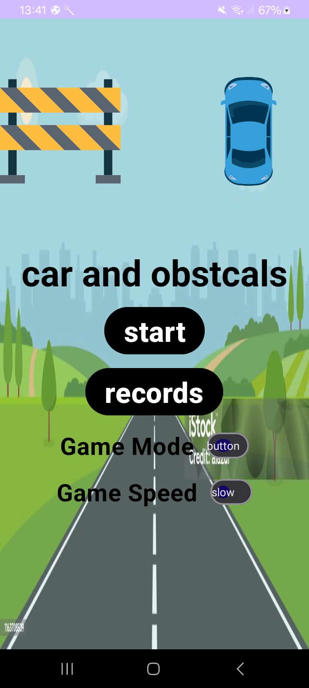
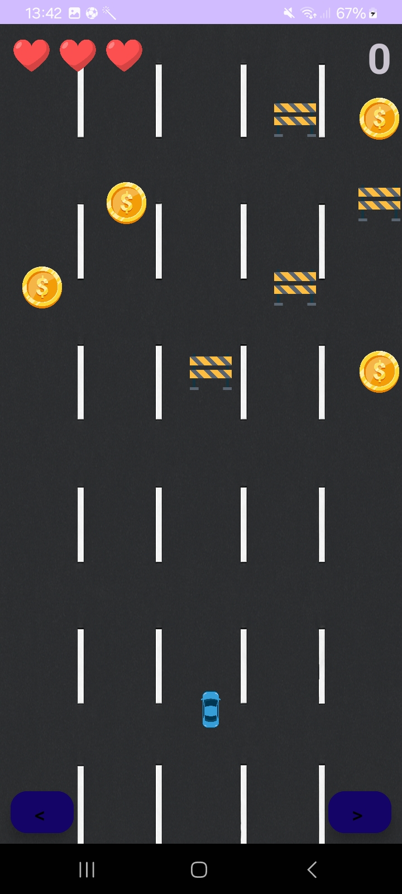
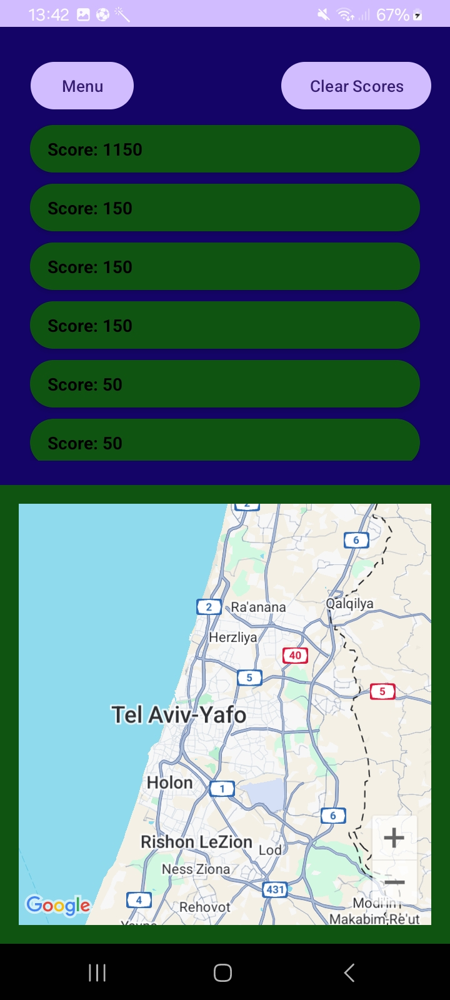
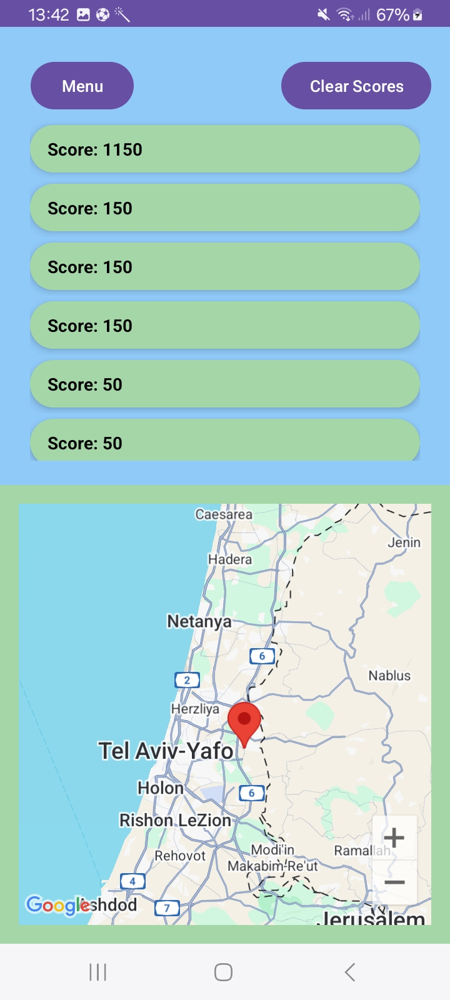

# Car & Obstacles

A mobile game made as part of Afeka’s **Mobile Apps – 25B10357** course.

> Collect coins, dodge roadblocks, and rack up a high score.
> Motion controls (tilt) and classic button controls are both supported.

---

## How to Run

This app uses Google Maps in the Records screen. You need a valid Maps API key saved with **Gradle Secrets**.

Create a file at the **project root** (same folder as `local.properties`) named `secrets.properties`:

```properties
MAPS_API_KEY=YOUR_API_KEY_HERE
```

> The project is already configured with the **Secrets Gradle Plugin**; just provide the key.

---

## Tech Stack

* **Language:** Kotlin (Kotlin DSL for Gradle)
* **Min/Target/Compile SDK:** as defined in module `build.gradle.kts`
* **UI:** Material Components, ViewBinding
* **Sensors:** Accelerometer (tilt control)
* **Audio:** `MediaPlayer` / simple sound player
* **Storage:** `SharedPreferences` (ScoreManager)
* **Location & Maps:** Fused Location + Google Maps SDK

---

## App Flow (Screens & Features)

### 1) Main Menu (with Settings)

The main screen includes the **game settings** (no separate settings screen):

* **Game Mode:**

  * **Buttons** – Left/Right FABs
  * **Tilt** – uses the device’s accelerometer (`TiltDetector`)
* **Game Speed:** 
  
 * **Slow**
 * **Fast**
    
* **Start** – launches the game
* **Records** – opens the highscores + map screen

**Screenshots**

| Light                                     | Dark                                    |
| ----------------------------------------- | --------------------------------------- |
|  |  |

> Put your images under `docs/images/` and use these names (or adjust the paths above).

---

### 2) Game Screen

* **Five lanes** road with obstacles and coins
* **Hearts** as lives
* **Score** increases when collecting coins
* **Controls**

  * **Buttons**: tap left/right
  * **Tilt**: lean the device to move; optional Y-tilt can adjust speed offset (if you enable it)
* **Audio**

  * Background music during gameplay (looped)
  * Coin pickup SFX
  * Obstacle hit SFX (and life is lost)

**Screenshot**

 

---

### 3) Records (High Scores + Map)

* **Top 10** scores are persisted via `ScoreManager` (`SharedPreferences`)
* Each score entry can store the **location** where it was achieved
* **Map** shows a marker at the last recorded location
* **Clear Scores** button to reset the list

**Screenshots**

| Dark                                          | Light                                           |
| --------------------------------------------- | ----------------------------------------------- |
|  | |

---

## Controls

* **Buttons Mode**: on-screen left/right buttons move the car between lanes
* **Tilt Mode**: `TiltDetector` listens to the accelerometer and calls back to move the car

---

## Sounds (where to put files)

Place audio files under `app/src/main/res/raw/`, for example:


app/src/main/res/raw/coin_collected.mp3
app/src/main/res/raw/boom_cinema.mp3

---

## Data & Persistence

* **ScoreManager**

  * Keeps an in-memory list of scores
  * Persists it as JSON in `SharedPreferences` (via Gson)
  * Keeps only the **top 10** (trims on update)

---

## Maps & Location

* **FusedLocationProvider** (for the location at score time)
* **SupportMapFragment** (shows Google Map on the records screen)
* API key handled securely with **Gradle Secrets** (see *How to Run*)

---


## Getting Started (quick)

1. **Clone** the repo and open in Android Studio.
2. Add your **`secrets.properties`** with `MAPS_API_KEY`.
3. Ensure `local.defaults.properties` exists with `MAPS_API_KEY=DEFAULT_API_KEY`.
4. **Sync Gradle** and **Run** on a device/emulator.

---

## Credits

* Icons & art: your assets under `/res/drawable`
* Sounds: your `.mp3` files under `/res/raw`
* Maps SDK for Android

---

### Notes on the screenshots

# If you want the exact layout like in your examples, name/place the files like this:


Mobile-applications-HW/docs/images/

  menu_light.jpg
  
  menu_dark.jpg
  
  game.jpg
  
  records_light.jpg
  
  records_dark.jpg
```

(You can drag the images into `docs/images/` in Android Studio’s “Project Files” view, then commit.)
